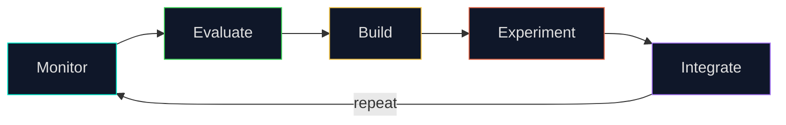
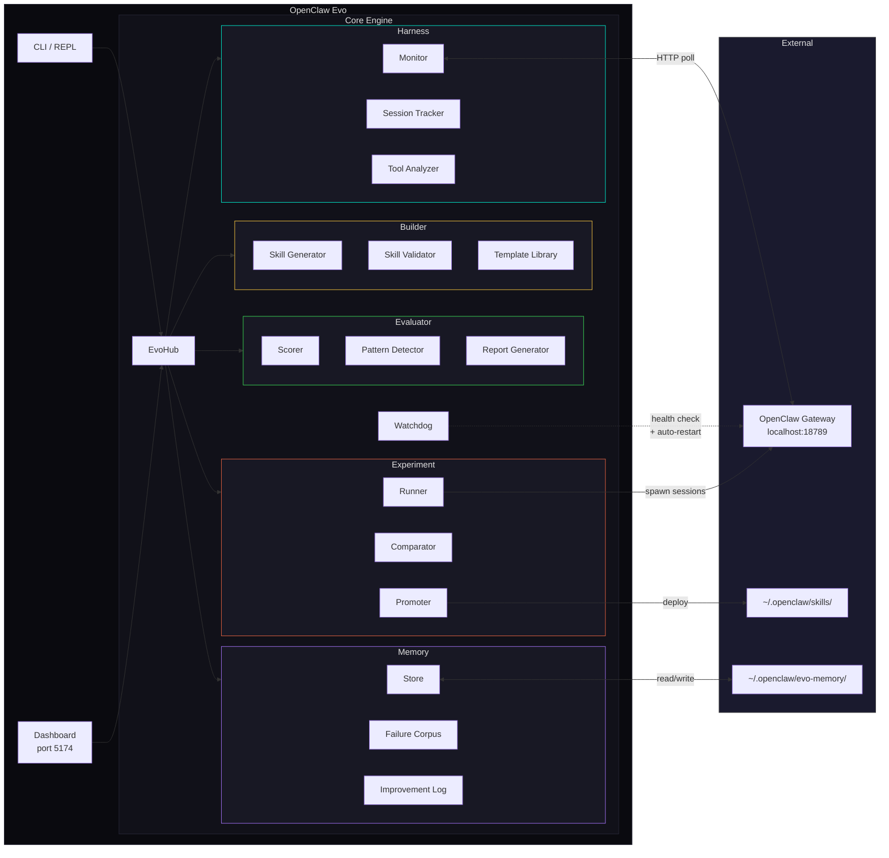
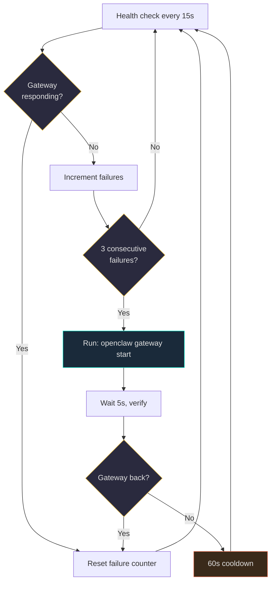
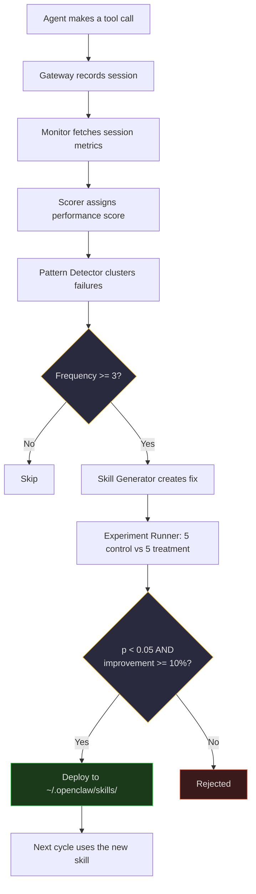
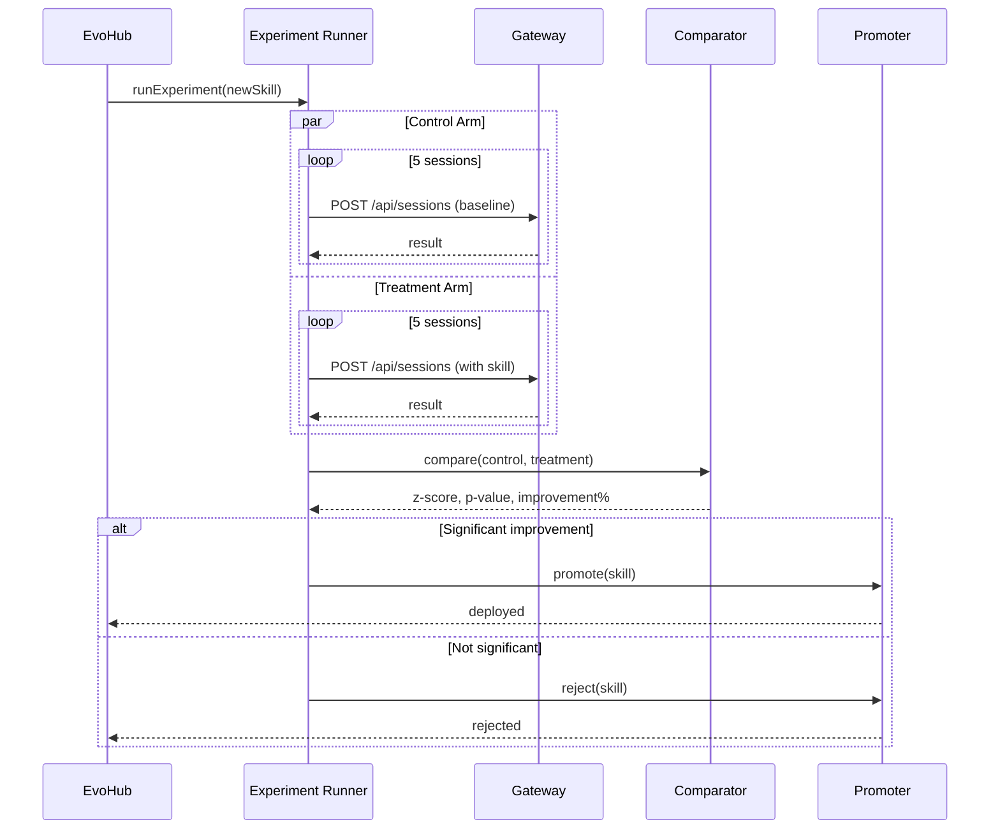

# OpenClaw Evo — Self-Evolving AI Assistant

[](https://github.com/DevvGwardo/openclaw-evo/actions/workflows/ci.yml)
[](https://nodejs.org)
[](https://www.typescriptlang.org)

> OpenClaw that monitors, evaluates, and improves itself — recursively.

**OpenClaw Evo** is a self-evolution engine for [OpenClaw](https://github.com/DevvGwardo/openclaw). It watches how your AI assistant performs, identifies recurring failures, automatically generates fixes (skills), A/B tests them with statistical rigor, and deploys the winners — continuously, without human intervention.

It also acts as a **supervisor** — if the OpenClaw gateway goes down, the built-in watchdog detects it and restarts it automatically.

## Quick Start

```bash
# Clone & install
git clone https://github.com/DevvGwardo/openclaw-evo.git && cd openclaw-evo && npm install

# Build
npm run build

# Start the evolution hub (interactive REPL)
npm run start:hub

# Run one evolution cycle and exit
npm run evolve:once

# Dashboard + hub (dev mode)
npm run dev

# Tests
npm run test
```

## How It Works

OpenClaw Evo runs a five-phase evolution cycle every 5 minutes:



| Phase | What happens |
|-------|-------------|
| **Monitor** | Fetches active sessions from the OpenClaw gateway, collects tool calls, errors, and latency into `SessionMetrics` |
| **Evaluate** | Scores sessions across 5 dimensions (accuracy, efficiency, speed, reliability, coverage) and mines recurring failure patterns |
| **Build** | For each top failure pattern, generates a new skill using parameterized templates, validates structure, computes a confidence score |
| **Experiment** | Runs A/B tests — spawns sessions with the new skill (treatment) vs. without (control), then runs a two-proportion z-test |
| **Integrate** | Promotes winners (p < 0.05, improvement >= 10%) to `~/.openclaw/skills/`, rejects losers, logs everything |

## Architecture



## Gateway Watchdog

The built-in watchdog monitors the OpenClaw gateway and restarts it automatically when it goes down.



- Polls gateway health every 15 seconds
- Restarts after 3 consecutive failures via `openclaw gateway start`
- 60-second cooldown between restart attempts
- Gives up after 10 restarts (requires manual intervention)
- Check status with the `watchdog` REPL command

| Setting | Default | Env var |
|---------|---------|---------|
| Check interval | 15s | `WATCHDOG_CHECK_INTERVAL_MS` |
| Failure threshold | 3 | `WATCHDOG_FAILURE_THRESHOLD` |
| Restart cooldown | 60s | `WATCHDOG_RESTART_COOLDOWN_MS` |
| Max restarts | 10 | `WATCHDOG_MAX_RESTARTS` |
| Restart command | `openclaw gateway start` | `WATCHDOG_RESTART_CMD` / `WATCHDOG_RESTART_ARGS` |
| Enable/disable | on | `WATCHDOG_ENABLED` |

## Data Flow: Failure to Fix



## Scoring

Sessions are scored on 5 weighted dimensions:

| Dimension | Weight | What it measures |
|-----------|--------|-----------------|
| **Accuracy** | 25% | Did the agent succeed at the task? |
| **Reliability** | 25% | Error rate (lower is better) |
| **Efficiency** | 20% | Tool calls vs. optimal (fewer is better) |
| **Speed** | 20% | Time to complete vs. baseline |
| **Coverage** | 10% | % of task types handled |

Weights are **adaptive** — if reliability drops below threshold, its weight automatically increases.

## A/B Experiment Flow



## CLI Commands

The hub starts an interactive REPL:

```
$ npm run start:hub

OpenClaw Evo > help

  status         Show hub status
  trigger        Trigger an evolution cycle now
  skills         List proposed and deployed skills
  approve <id>   Approve a proposed skill by id
  logs           Show recent evolution cycle logs
  stats          Show performance statistics
  watchdog       Show gateway watchdog status
  restart        Stop and restart the hub
  quit           Exit the REPL
```

## Configuration

All defaults live in `src/constants.ts` and can be overridden via environment variables:

| Setting | Default | Env var |
|---------|---------|---------|
| Cycle interval | 5 min | `CYCLE_INTERVAL_MS` |
| Failure threshold | 3 | `FAILURE_THRESHOLD` |
| Max skills per cycle | 3 | `MAX_SKILLS_PER_CYCLE` |
| Experiment sessions per arm | 5 | `EXPERIMENT_SESSIONS` |
| Min improvement to deploy | 10% | `MIN_IMPROVEMENT_PCT` |
| Statistical confidence | 95% | `STATISTICAL_CONFIDENCE` |
| Gateway URL | `http://localhost:18789` | `OPENCLAW_GATEWAY_URL` |
| Poll interval | 10s | `OPENCLAW_POLL_INTERVAL_MS` |
| Skill output dir | `~/.openclaw/skills/` | `SKILL_OUTPUT_DIR` |
| Memory dir | `~/.openclaw/evo-memory/` | `MEMORY_DIR` |
| Dashboard port | 5174 | `DASHBOARD_PORT` |

## Repository Structure

```
openclaw-evo/
├── src/
│   ├── hub.ts                  # EvoHub — main orchestrator
│   ├── cli.ts                  # Interactive REPL entry point
│   ├── server.ts               # HTTP API server (port 5174)
│   ├── watchdog.ts             # Gateway health monitor + auto-restart
│   ├── types.ts                # Shared TypeScript interfaces
│   ├── constants.ts            # Default configuration
│   ├── harness/
│   │   ├── monitor.ts          # Gateway event monitoring
│   │   ├── sessionTracker.ts   # Per-session lifecycle tracking
│   │   └── toolAnalyzer.ts     # Tool call pattern analysis
│   ├── evaluator/
│   │   ├── scorer.ts           # Multi-dimensional performance scoring
│   │   ├── patternDetector.ts  # Failure pattern clustering
│   │   └── reportGenerator.ts  # Evaluation report assembly
│   ├── builder/
│   │   ├── skillGenerator.ts   # Generate skills from failures
│   │   ├── skillValidator.ts   # Structural validation
│   │   └── templateLibrary.ts  # Parameterized skill templates
│   ├── experiment/
│   │   ├── runner.ts           # A/B test session spawning
│   │   ├── comparator.ts       # Two-proportion z-test
│   │   └── promoter.ts         # Promotion/rejection logic
│   ├── memory/
│   │   ├── store.ts            # JSON file persistence
│   │   ├── failureCorpus.ts    # Recurring failure database
│   │   └── improvementLog.ts   # Audit trail of all changes
│   └── openclaw/
│       ├── gateway.ts          # OpenClaw gateway HTTP client
│       ├── sessionManager.ts   # Session CRUD
│       └── skillManager.ts     # Skill deployment
├── dashboard/
│   └── src/
│       ├── App.tsx             # React dashboard UI
│       └── api/
│           └── evoClient.ts    # Dashboard API client
├── docs/
│   ├── ARCHITECTURE.md         # Detailed architecture docs
│   ├── DIAGRAM.md              # Full Mermaid diagrams
│   ├── API.md                  # HTTP API reference
│   ├── CONFIGURATION.md        # Config deep dive
│   ├── SELF_IMPROVEMENT.md     # How recursive improvement works
│   ├── ADDING_TEMPLATES.md     # How to add skill templates
│   ├── EXAMPLES.md             # Usage examples
│   └── TROUBLESHOOTING.md      # Common issues
├── tests/
│   ├── harness.test.ts
│   ├── evaluator.test.ts
│   ├── builder.test.ts
│   └── experiment.test.ts
├── package.json
├── tsconfig.json
└── vitest.config.ts
```

## Dashboard

The web dashboard at `http://localhost:5174` shows real-time evolution status:

- **Performance scores** — Overall health with sparkline trend
- **Failure patterns** — Top failures ranked by frequency, color-coded by severity
- **Proposed skills** — Generated fixes with approve/reject buttons
- **Active experiments** — Live A/B test results with statistical significance
- **Cycle history** — Recent evolution cycles with phase breakdowns
- **Improvement log** — Audit trail of all deployed changes

## Prerequisites

- Node.js 20+
- OpenClaw gateway running (`openclaw gateway start`) — or let the watchdog start it for you

## Contributing

Contributions welcome! See [CONTRIBUTING.md](CONTRIBUTING.md).

Key areas:
- **Builder**: Better skill generation algorithms
- **Evaluator**: More sophisticated scoring models
- **Experiment**: Better statistical methods
- **Dashboard**: Better visualizations

## License

MIT — see [LICENSE](LICENSE)
